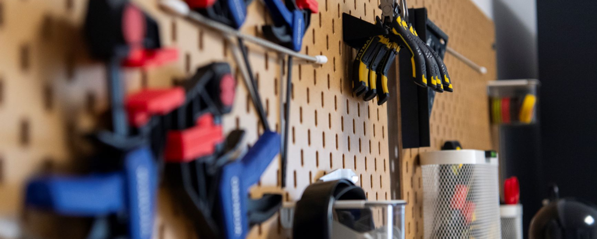

# Fablab's tools index

> This document is a repository for all the tools available in the Fablab. It is intended to be a quick reference for the users of the Fablab.

## Electronic hardware

- [3D Printer | Bambulab X1 Carbon](hardware/bambulab.md)
- [Multi-function station | SnapMaker Artisan](hardware/snapmaker.md) (WIP)
- Single Board Computers
  - [RaspberryPi 5](https://www.raspberrypi.com/products/raspberry-pi-5/)
  - [RaspberryPi 400](https://www.raspberrypi.com/products/raspberry-pi-400/)
  - [OrangePi 5B](http://www.orangepi.org/html/hardWare/computerAndMicrocontrollers/details/Orange-Pi-5B.html)
  - [OrangePi 5 Plus](http://www.orangepi.org/html/hardWare/computerAndMicrocontrollers/details/Orange-Pi-5-plus.html)
- Micro-controllers
  - [ESP8266](https://en.wikipedia.org/wiki/ESP8266)
  - [ESP32 & Featherwing](https://www.adafruit.com/product/4264)
  - [TotemDuino Micro Lab](https://totemmaker.net/product/totemduino-microlab/)
- Sensors
  - ESP32 Cam
  - PIR sensor
  - Picamera 2 NoIR
  - Picamera 3
  - Webcam full HD
  - Audio-technica usb microphone
  - ASK 130 Conference Speaker & Microphone
  - EL019 Speaker
- Samsung Tablets
- Soldering kit
- Multimeter

## Mechanical hardware

- Heat Gun Seekone
- Glue gun Bosch
- Drill Bosh
- Hand-drill Bosh
- Sanding machine Black & Decker

## Software

- CAO | FreeCAD WIP
- [3D slicer | OrcaSlicer for Bambulab](software/orcaslicer.md)
- 3D slicer | Luban for Snapmaker (WIP)
- Code editor : Vscode & PlatformIO (WIP)
- [Raspberry Pi imager](https://www.raspberrypi.com/software/)
- [BalenaEtcher](https://etcher.balena.io/)

## Consumables

- [Filament | FDM plastics](consumables/filament.md)
- Wood planks
- Metal sheets

## Dangers and risks

All safety equipments are listed in [this guide](safety/equipements.md).

| Material         | Risk                      | Protection                             | Relevant ISO Standards |
| ---------------- | ------------------------- | -------------------------------------- | ---------------------- |
| 3D Printer & ABS | Fumes                     | Ventilation, opening windows           | ISO 16000              |
| CNC & wood       | Dust, projections         | Mask, vacuum cleaner, glasses          | ISO 16000 , ISO 13849  |
| CNC & metal      | Chips, projections        | Glasses, gloves                        | ISO 13849 , ISO 45001  |
| CNC & plastic    | Chips, projections, Fumes | Mask, glasses, gloves, opening windows | ISO 13849 , ISO 16000  |
| Soldering iron   | Burns, projections        | Gloves, glasses                        | ISO 45001 , ISO 13849  |
| Heat Gun         | Burns, projections        | Gloves, glasses                        | ISO 45001 , ISO 13849  |
| Glue gun         | Burns                     | Gloves                                 | ISO 45001              |
| Drill            | Projections, injuries     | Glasses, gloves                        | ISO 13849 , ISO 45001  |
| Sanding machine  | Dust, projections         | Mask, glasses, gloves                  | ISO 16000 , ISO 13849  |
| Soldering kit    | Burns, projections        | Gloves, glasses                        | ISO 45001 , ISO 13849  |

Explanation of ISO standards tackled in the table:

- **ISO 16000**: Indoor air quality.
- **ISO 13849**: Safety of machinery.
- **ISO 45001**: Occupational health and safety.

---

Last update: Jan. 2025

Author: Yann VIDAMMENT
