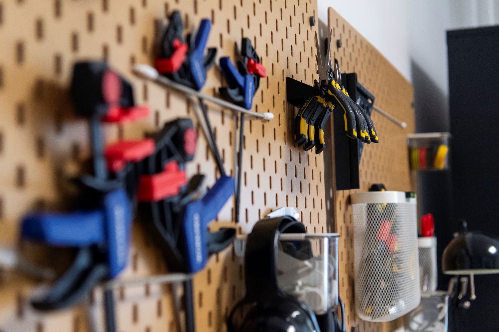

# Fablab 's tools index

> This document is a repository for all the tools available in the Fablab. It is intended to be a quick reference for the users of the Fablab.

## Hardware list

- [3D Printer | Bambulab X1 Carbon](hardware/bambulab.md)
- [CNC | SnapMaker Artisan](hardware/snapmaker.md)

## Software list

- CAO
- [3D slicer | OrcaSlicer](software/orcaslicer.md)
- CNC
- Code editor : Vscode + PlatformIO
- Raspberry Pi imager
- BalenaEtcher

## Consumables list

- [Filament | FDM plastics](consumables/filament.md)

## Safety list

- [EPI | Personal Protective Equipment](safety/epi.md)
- [Fire extinguisher | Fire safety](safety/fire.md)
- [First aid kit | First aid](safety/firstaid.md)

---

Last update: Nov. 2024
