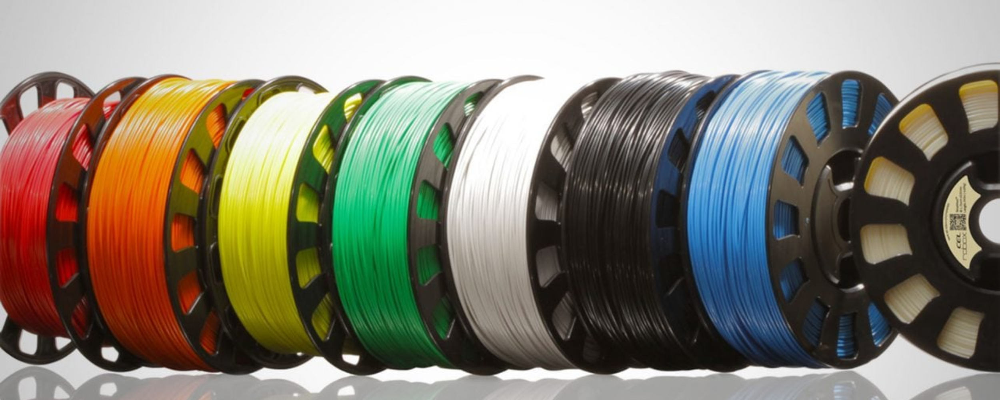

# 3D Filament

> This guide will show you the different types of filament available for 3D printing and their characteristics.

## TOC

- [3D Filament](#3d-filament)
  - [TOC](#toc)
  - [Introduction](#introduction)
  - [Standard plastics](#standard-plastics)
  - [Engineering plastics](#engineering-plastics)
  - [Composite plastics](#composite-plastics)

## Introduction

There are three main types of filaments used in 3D printing: standard plastics, engineering plastics, and composite plastics. Each type has its own characteristics and is suitable for different applications.

Though, they share some common properties:

- They are **all thermoplastics**, meaning they can be melted and reshaped multiple times.
- They are all available in a **wide range of colors** and finishes.
- They are **all available in 1.75mm** and 2.85mm diameters even if 1.75mm is the general standard.

## Standard plastics

Standard filament material require no particular handling and are easy to print. They are the most common materials used in 3D printing and are suitable for most applications. They offer a natural compatibility the Bambulab AMS (Automatic Material System). see [ref](../hardware/bambulab.md).

| Material                             | PLA                       | PETG                           | ABS                            |
| ------------------------------------ | ------------------------- | ------------------------------ | ------------------------------ |
| **Grade**                            | 9/10                      | 9/10                           | 8/10                           |
| **Ultimate Strength**                | 65 MPa                    | 53 MPa                         | 40 MPa                         |
| **Durability**                       | 6/10                      | 8/10                           | 9/10                           |
| **Maximum Service Temperature**      | 52°C                      | 73°C                           | 98°C                           |
| **Coefficient of Thermal Expansion** | 68 µm/m°C                 | 60 µm/m°C                      | 90 µm/m°C                      |
| **Density**                          | 1.24 g/cm³                | 1.23 g/cm³                     | 1.04 g/cm³                     |
| **Price**                            | 10 - 40 €/kg              | 20 - 60 €/kg                   | 10 - 40 €/kg                   |
| **Printability**                     | 9/10                      | 8/10                           | 9/10                           |
| **Extruder Temperature**             | 190 - 220°C               | 230 - 250°C                    | 220 - 250°C                    |
| **Bed Temperature**                  | 45 - 60°C                 | 75 - 90°C                      | 95 - 110°C                     |
| **Recommended Build Surface**        | Smooth/Textured PEI Plate | Glue Stick, Textured PEI Plate | Glue Stick, Textured PEI Plate |
| **Other Hardware Recommendations**   | Cooling fan               | Cooling Fan                    | Enclosure Recommended          |
| **Impact Resistance**                | :x:                       | :x:                            | :white_check_mark:             |
| **UV Resistant**                     | :x:                       | :x:                            | :x:                            |
| **Water Resistant**                  | :x:                       | :white_check_mark:             | :x:                            |
| **Chemically Resistant**             | :x:                       | :white_check_mark:             | :x:                            |

## Engineering plastics

Engineering plastics are more resistant and durable than standard plastics. They are suitable for more demanding applications. They require more specific handling and are more difficult to print. They **should not be used** with the AMS but rather placed on the spool holder.

| Material                             | Flex                           | Nylon                          | ASA                            | Polycarbonate                   |
| ------------------------------------ | ------------------------------ | ------------------------------ | ------------------------------ | ------------------------------- |
| **Grade**                            | 6/10                           | 8/10                           | 7/10                           | 7/10                            |
| **Ultimate Strength**                | 26-43 MPa                      | 40-85 MPa                      | 55 MPa                         | 72 MPa                          |
| **Durability**                       | 9/10                           | 10/10                          | 10/10                          | 10/10                           |
| **Maximum Service Temperature**      | 70°C                           | 90°C                           | 65°C                           | 120°C                           |
| **Coefficient of Thermal Expansion** | 70 µm/m°C                      | 95 µm/m°C                      | 85 µm/m°C                      | 68 µm/m°C                       |
| **Density**                          | 1.19 - 1.23 g/cm³              | 1.12 g/cm³                     | 1.07 g/cm³                     | 1.2 g/cm³                       |
| **Price**                            | 30-70 €/kg                     | 25-65 €/kg                     | 30-40 €/kg                     | 40-75 €/kg                      |
| **Printability**                     | 6/10                           | 8/10                           | 7/10                           | 7/10                            |
| **Extruder Temperature**             | 225 - 245°C                    | 230 - 260°C                    | 240 - 270°C                    | 260 - 310°C                     |
| **Bed Temperature**                  | 45 - 60°C                      | 70 - 90°C                      | 90 - 110°C                     | 80 - 120°C                      |
| **Recommended Build Surface**        | Glue Stick, Textured PEI Plate | Glue Stick, Textured PEI Plate | Glue Stick, Textured PEI Plate | Glue Stick, Textured PEI Plate  |
| **Other Hardware Recommendations**   | Cooling Fan                    | Enclosure Required             | Enclosure Required             | Enclosure Required, Cooling Fan |
| **Impact Resistance**                | :x:                            | :white_check_mark:             | :white_check_mark:             | :white_check_mark:              |
| **UV Resistant**                     | :x:                            | :x:                            | :white_check_mark:             | :x:                             |
| **Water Resistant**                  | :x:                            | :white_check_mark:             | :white_check_mark:             | :x:                             |
| **Chemically Resistant**             | :x:                            | :x:                            | :x:                            | :x:                             |

## Composite plastics

Composite filaments are made of a base material and a filler material. They offer unique properties such as increased strength, weight reduction, or a wood-like finish. They require specific handling and are more difficult to print. They **should not be used** with the AMS but rather placed on the spool holder.

| Material                             | Carbon Fiber Filled                   | Metal Filled                                               | Wood Filled                           |
| ------------------------------------ | ------------------------------------- | ---------------------------------------------------------- | ------------------------------------- |
| **Grade**                            | 8/10                                  | 7/10                                                       | 8/10                                  |
| **Ultimate Strength**                | 45 MPa                                | 20-30 MPa                                                  | 46 MPa                                |
| **Durability**                       | 3/10                                  | 4/10                                                       | 3/10                                  |
| **Maximum Service Temperature**      | 52°C                                  | 52°C                                                       | 52°C                                  |
| **Coefficient of Thermal Expansion** | 57.5 µm/m°C                           | 33.75 µm/m°C                                               | 30.5 µm/m°C                           |
| **Density**                          | 1.3 g/cm³                             | 2-4 g/cm³                                                  | 1.15 - 1.25 g/cm³                     |
| **Price**                            | 30-80 €/kg                            | 50-120 €/kg                                                | 25-55 €/kg                            |
| **Printability**                     | 7/10                                  | 8/10                                                       | 6/10                                  |
| **Extruder Temperature**             | 200 - 230°C                           | 190 - 220°C                                                | 190 - 220°C                           |
| **Bed Temperature**                  | 45 - 60°C                             | 45 - 60°C                                                  | 45 - 60°C                             |
| **Recommended Build Surface**        | Glue Stick, Smooth/Textured PEI Plate | Glue Stick, Smooth/Textured PEI Plate                      | Glue Stick, Smooth/Textured PEI Plate |
| **Other Hardware Recommendations**   | Cooling Fan                           | Wear Resistant or Stainless Steel Nozzle, Part Cooling Fan | Cooling Fan                           |
| **Impact Resistance**                | :x:                                   | :white_check_mark:                                         | :x:                                   |
| **UV Resistant**                     | :x:                                   | :x:                                                        | :x:                                   |
| **Water Resistant**                  | :x:                                   | :x:                                                        | :x:                                   |
| **Chemically Resistant**             | :x:                                   | :x:                                                        | :x:                                   |

---

Last update: Nov. 2024
Author: Yann VIDAMMENT
