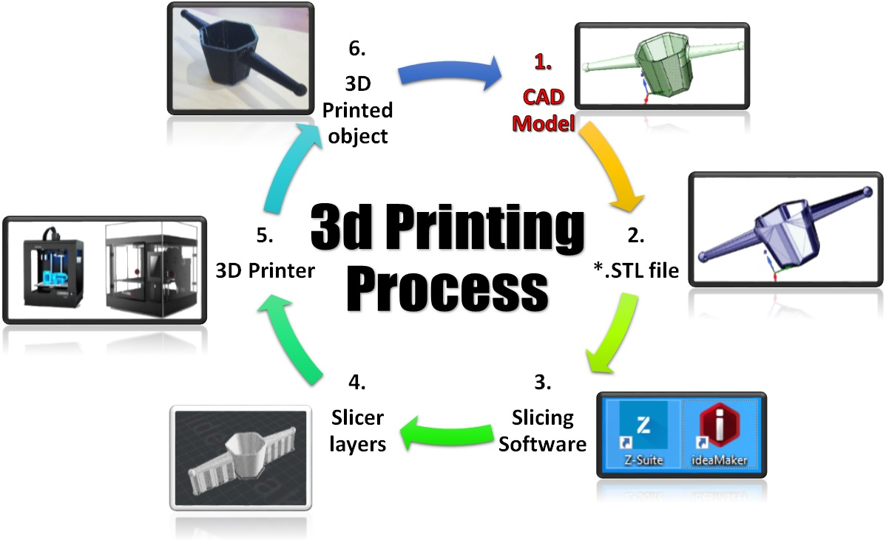
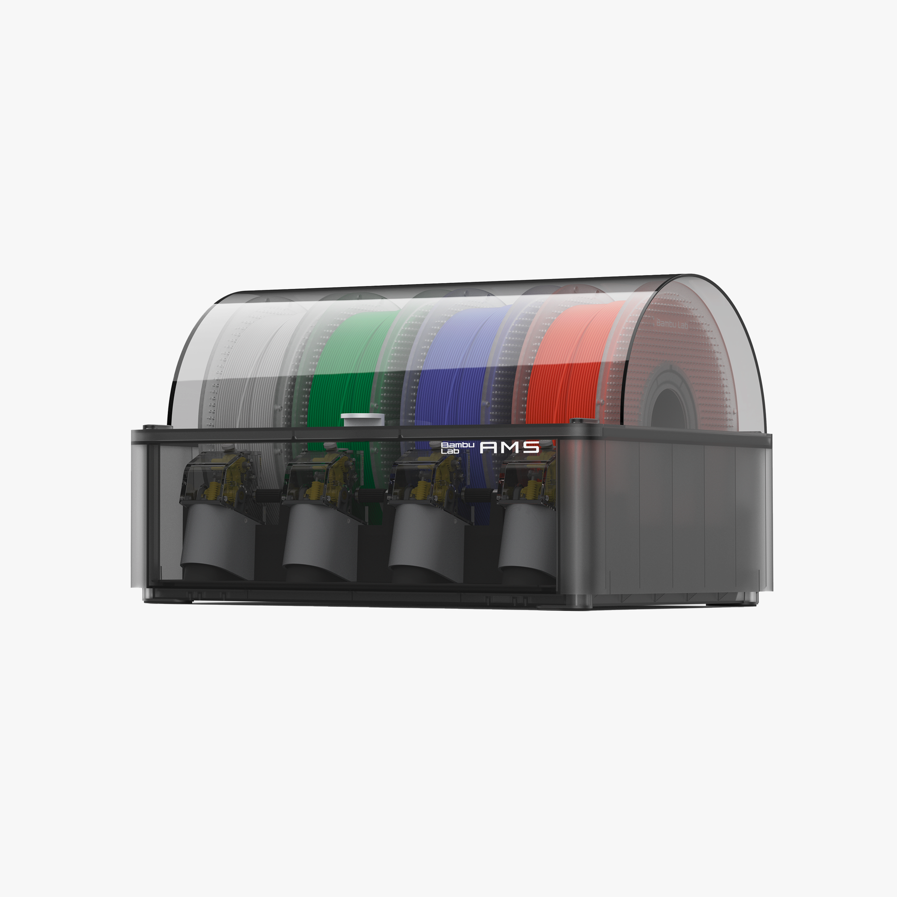
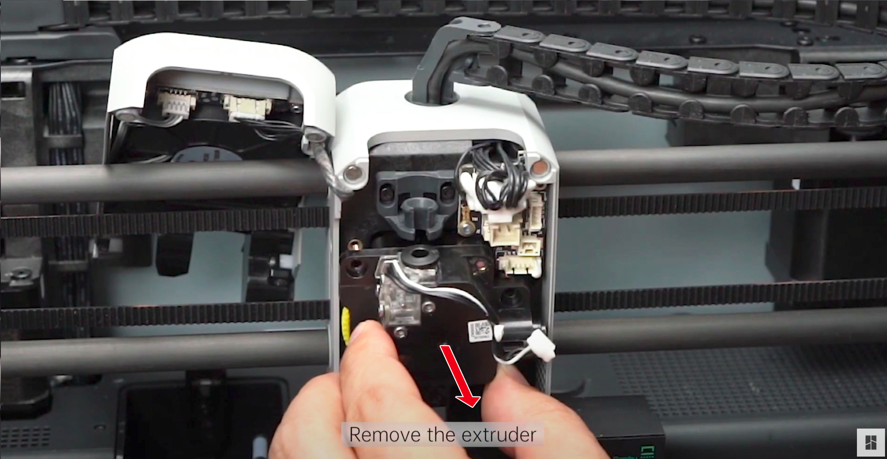
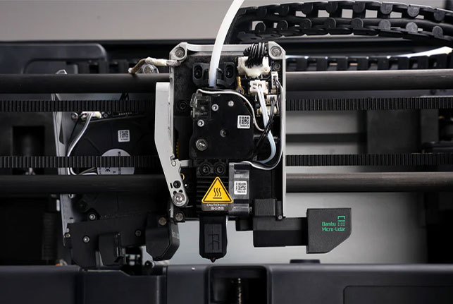
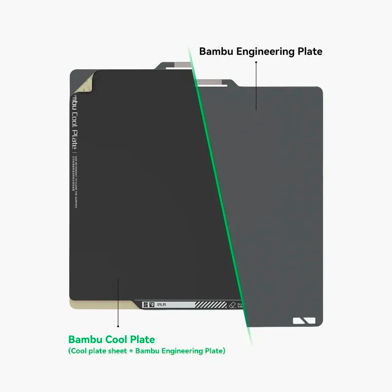

# Imprimante 3D - Bambulab X1 Carbon

> Ce guide vous apprendra à préparer et imprimer un modèle 3D en utilisant l'imprimante 3D Bambulab X1 Carbon.

## Table des matières

- [Imprimante 3D - Bambulab X1 Carbon](#imprimante-3d---bambulab-x1-carbon)
  - [Table des matières](#table-des-matières)
  - [Introduction](#introduction)
  - [Risques et protections](#risques-et-protections)
  - [L'imprimante](#limprimante)
    - [L'AMS (spécifique à Bambulab)](#lams-spécifique-à-bambulab)
    - [L'extrudeuse](#lextrudeuse)
    - [Le corps chauffant](#le-corps-chauffant)
    - [La plaque](#la-plaque)
  - [Les filaments](#les-filaments)
  - [Protocole d'impression](#protocole-dimpression)
    - [Récupération du fichier](#récupération-du-fichier)
    - [Découpage de vos fichiers](#découpage-de-vos-fichiers)
    - [Préparation de l'imprimante](#préparation-de-limprimante)

## Introduction

L'impression 3D par modélisation par dépôt de filament (FDM) est la méthode la plus courante pour l'impression 3D. Elle consiste à déposer un fil de matériau thermoplastique fondu sur une plaque, couche par couche, pour créer un objet tridimensionnel.

L'équipement nécessaire pour l'impression 3D est le suivant :

- Une imprimante 3D FDM (ici Bambulab X1 Carbon)
- Un filament thermoplastique
- Un ordinateur avec un logiciel de découpage
- Le fichier de l'objet à imprimer

Voici un schéma détaillé pour comprendre le processus :

## Risques et protections

| Matériau                    | Risque | Protection                                                          |
| --------------------------- | ------ | ------------------------------------------------------------------- |
| Plastiques standards \ ABS  | Aucun  | Aucune                                                              |
| Plastiques techniques & ABS | Fumées | Ventilation, ouverture des fenêtres                                 |
| Plastiques composites       | Fumées | Ventilation, ouverture des fenêtres, éviter de rester dans la pièce |

## L'imprimante

### L'AMS (spécifique à Bambulab)

L'AMS Bambulab est un système de gestion automatique des matériaux qui permet l'impression 3D avec jusqu'à quatre filaments différents sans avoir à changer manuellement les bobines. Il utilise un système de reconnaissance automatique des filaments (RFID) pour identifier les bobines et un système de changement automatique des bobines (ABC) pour les changer automatiquement lorsque le filament est épuisé. L'AMS est également équipé d'un système de séchage des filaments pour éliminer l'humidité et améliorer la qualité d'impression.

### L'extrudeuse

L'extrudeuse est le module qui tire le filament. Elle se compose d'un moteur pas à pas qui entraîne un engrenage qui fait avancer le filament dans le corps chauffant. Elle est sujette aux bourrages ou aux blocages pendant l'utilisation (utile à savoir pour le dépannage).
L'extrudeuse de l'imprimante Bambulab X1 Carbon est une extrudeuse directe. Cela signifie qu'elle est située directement au-dessus de la plaque d'impression. Cela permet un meilleur contrôle de la température et de la pression du filament, résultant en des impressions de meilleure qualité. L'extrudeuse X1 Carbon est également équipée d'un système de refroidissement par eau, qui permet d'imprimer des filaments à haute température comme le PETG et le Nylon.

### Le corps chauffant

Après être passé par l'extrudeuse, le filament entre dans le corps chauffant. Il se compose d'un tube en PTFE (Téflon) qui guide le filament vers la buse. Il est également équipé d'une cartouche chauffante qui fait fondre le filament et d'un capteur de température qui contrôle la température du filament. Les températures varient en fonction des filaments utilisés (voir ci-dessous).

### La plaque

Enfin, la plaque est la surface sur laquelle l'impression est réalisée. Elle est chauffée pour permettre une meilleure adhésion du filament. Elle est également équipée d'un capteur de température qui contrôle la température de la plaque. Les températures varient également en fonction des filaments utilisés (voir ci-dessous). Des plaques texturées existent pour améliorer l'adhésion du filament. Il est également possible d'utiliser des surfaces d'impression amovibles (BuildTak, PEI ou satin) pour faciliter le retrait de l'impression.

## Les filaments

Le filament pour imprimante 3D est l'une des catégories de matériaux d'impression 3D les plus couramment utilisées au monde. Contrairement à la poudre et à la résine liquide et autres technologies d'impression 3D, le filament est produit sous la forme d'un fil plastique fin et continu de plusieurs centaines de mètres de long, généralement enroulé sur une bobine pour le stockage et l'alimentation dans l'imprimante. Déterminé par le processus d'extrusion thermique des imprimantes FDM, le matériau brut du filament est un matériau thermoplastique incluant les plastiques les plus couramment utilisés dans la vie quotidienne, ainsi que certains matériaux à formule spéciale pour certaines utilisations.

Pour plus d'informations sur les filaments, consultez le guide [Filament | Plastiques FDM](../consumables/filament.md).

## Protocole d'impression

### Récupération du fichier

La première étape consiste à récupérer le fichier à imprimer. Ce fichier doit être dans un format compatible avec le logiciel de découpage utilisé. Le format le plus courant est .stl (dans certains cas .obj). Le fichier peut être téléchargé depuis Internet, créé à l'aide d'un logiciel de CAO ou scanné à l'aide d'un scanner 3D.

Les principales sources de modèles 3D sont :

- [Thingiverse](https://www.thingiverse.com/), supporté par Cura
- [Printables](https://www.prusaprinters.org/prints), supporté par Prusa
- [MakerWorld](https://www.makerworld.com/), supporté par Bambulab
- [Cults3D](https://cults3d.com/), indépendant

En outre, vous pouvez rencontrer des fichiers .3mf, qui sont un format conteneur pouvant stocker des modèles 3D, des données associées et des métadonnées dans un seul fichier. Ce format est supporté par Orcaslicer.

### Découpage de vos fichiers

La deuxième étape consiste à découper le fichier. Le découpage est le processus de conversion d'un fichier de modèle 3D en un ensemble d'instructions pour l'imprimante 3D. Cet ensemble d'instructions est appelé G-code. Le logiciel de découpage permet de configurer les paramètres d'impression (hauteur de couche, vitesse d'impression, température, etc.) et de visualiser l'impression avant de la démarrer.

Pour plus d'informations sur le logiciel de découpage, consultez le guide [3D slicer | OrcaSlicer](../software/orcaslicer.md).

### Préparation de l'imprimante

Une fois votre fichier découpé, vous devez préparer l'imprimante. Cela implique de vérifier :

- Que le filament est correctement chargé à l'arrière de l'imprimante ou que l'AMS est branché et reconnu
- Qu'il y a suffisamment de filament pour l'impression que vous envisagez de faire
- Que la plaque est propre et nivelée

Une fois que tout est prêt, vous pouvez démarrer l'impression. L'imprimante chauffera la plaque et l'extrudeuse aux températures requises et commencera à imprimer.

---

Dernière mise à jour : Nov. 2024
Auteur : Yann VIDAMMENT
