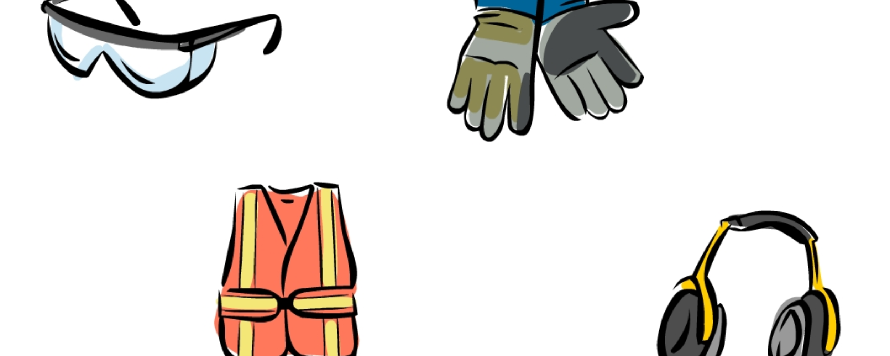
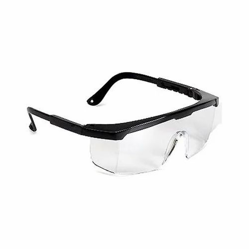
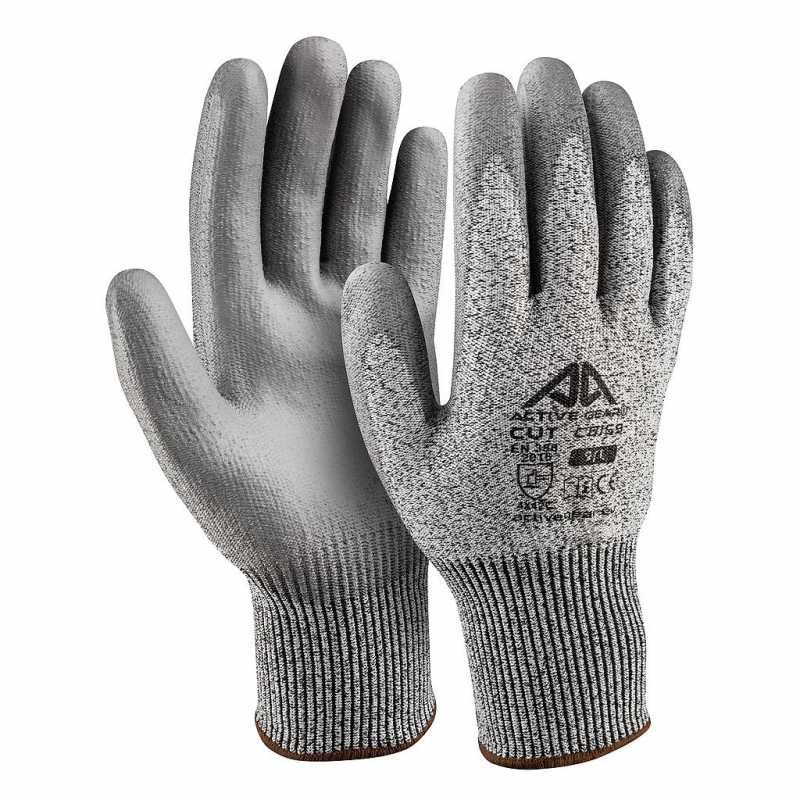
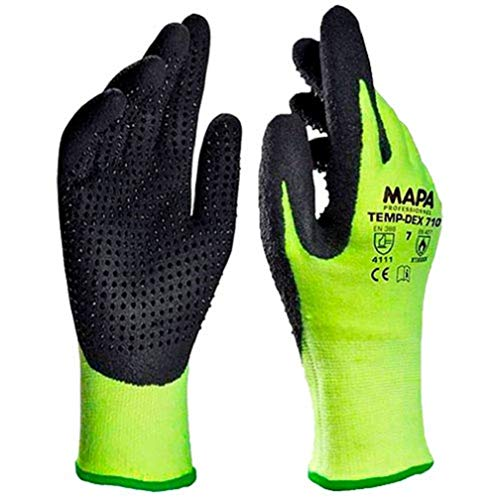
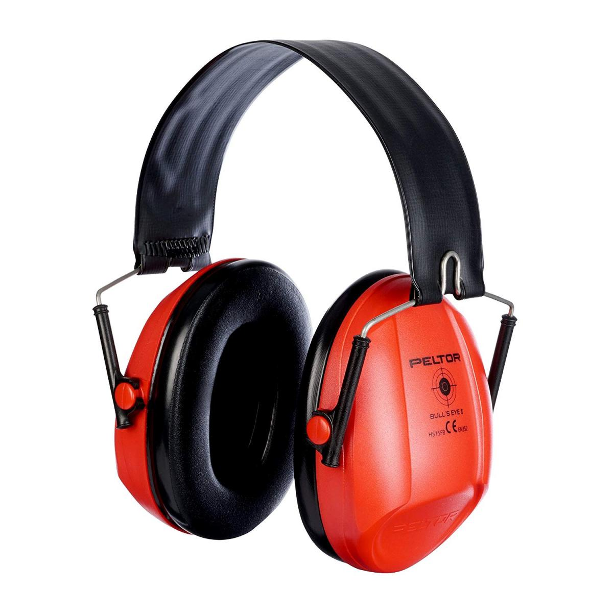
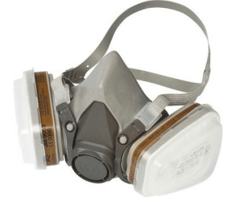

# Équipements de sécurité

> Ce guide vous montrera quels équipements de sécurité sont disponibles dans le Fablab et quand les utiliser.

## Table des matières

- [Équipements de sécurité](#équipements-de-sécurité)
  - [Table des matières](#table-des-matières)
  - [Introduction](#introduction)
  - [EPI | Équipement de Protection Individuelle](#epi--équipement-de-protection-individuelle)
  - [Extincteur](#extincteur)
  - [Trousse de premiers secours](#trousse-de-premiers-secours)
  - [Numéros à appeler](#numéros-à-appeler)

## Introduction

Travailler dans un Fablab n'est pas une activité sans risque et nécessite du temps pour déterminer quelle protection est adaptée à quelle technique de fabrication. La précipitation sera la principale cause d'accidents.

Ce guide abordera à la fois les équipements de prévention et les procédures de réponse aux dangers.

Si vous avez des doutes ou des questions, veuillez vous référer à votre superviseur.

## EPI | Équipement de Protection Individuelle

L'Équipement de Protection Individuelle est indispensable dans un Fablab. C'est la première ligne de défense contre les accidents. Voici une liste des EPI disponibles dans le Fablab :

| Équipement                    | Dangers auxquels il répond | Illustration                        |
| ----------------------------- | -------------------------- | ----------------------------------- |
| Lunettes en plastique         | Projections, copeaux       |  |
| Gants résistants aux coupures | Coupe, scie, cutter        |     |
| Gants résistants à la chaleur | Forte chaleur              |     |
| Casque antibruit              | Bruits forts               |    |
| Masque à gaz                  | Fumées, projections        |    |

## Extincteur

Il existe deux types d'extincteurs que nous pouvons utiliser :

- **Extincteur à eau** : Ce type d'extincteur est utilisé pour les feux de classe A. Il est très efficace pour éteindre les feux de bois, de papier et de textile. Il n'est pas recommandé pour les feux électriques ou les liquides inflammables car il projette de l'eau à haute pression.
- **Extincteur à CO2** : Ce type d'extincteur est utilisé pour les feux de classe B et C. Il est efficace pour éteindre les feux électriques et les liquides inflammables. Il n'est pas recommandé pour les feux de classe A car il ne refroidit pas le feu.

## Trousse de premiers secours

Vous pouvez trouver une trousse de premiers secours dans le couloir. Elle contient les éléments suivants :

- **Bandages** : Pour couvrir les plaies et arrêter les saignements.
- **Compresses de gaze** : Pour arrêter les saignements.
- **Désinfectant** : Pour nettoyer les plaies.
- **Ciseaux** : Pour couper les bandages.
- **Pince à épiler** : Pour enlever les échardes.
- **Couverture** : Pour garder la victime au chaud.
- **Bande triangulaire** : Pour immobiliser un membre.
- **Gants** : Pour protéger le secouriste.
- **Lotion pour les yeux** : Pour nettoyer les yeux.

Pour plus d'informations, une liste exhaustive est disponible sur la trousse de premiers secours elle-même.

## Numéros à appeler

En cas d'urgence, voici les numéros à appeler :

- **Pompiers** : 18 (ligne directe depuis le bâtiment)
- **Ambulance** : 15
- **Centre antipoison** : 01 40 05 48 48

---

Dernière mise à jour : Nov. 2024
Auteur : Yann VIDAMMENT
