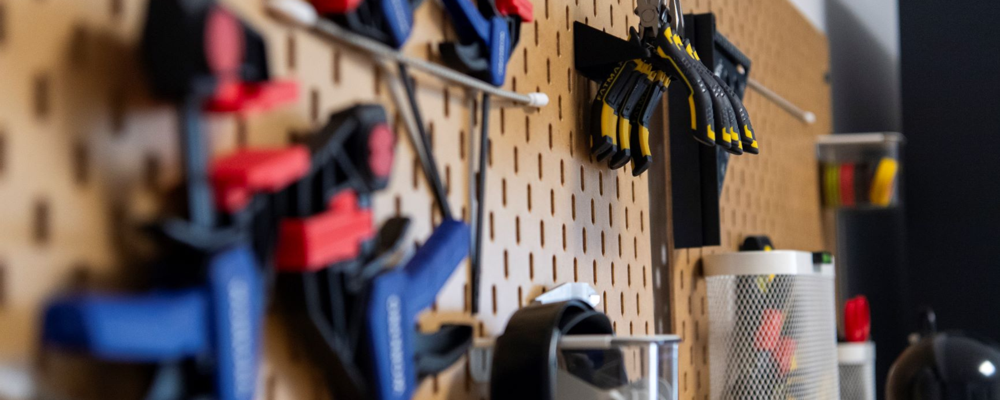

# Subject

> This is a template for a subject.

## Table of Contents

- [Subject](#subject)
  - [Table of Contents](#table-of-contents)
  - [Introduction](#introduction)
  - [Risks and protections](#risks-and-protections)
  - [SubSubject 1](#subsubject-1)
  - [SubSubject 2](#subsubject-2)

## Introduction

## Risks and protections

| Material           | Risk          | Protection               |
| ------------------ | ------------- | ------------------------ |
| Machine or product | List of risks | Ways to protect yourself |

## SubSubject 1

## SubSubject 2

---

Last update: Month. Year

Author: John DOE
