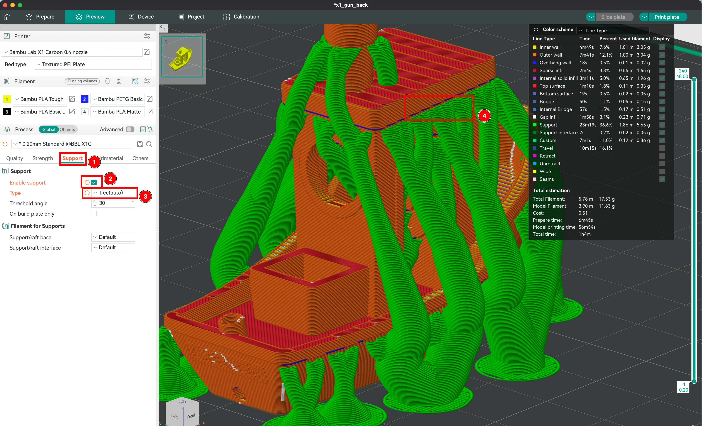

# 3D Slicer - OrcaSlicer

> This guide will teach you how to use OrcaSlicer to prepare your 3D models for printing.

## Table of Contents

- [3D Slicer - OrcaSlicer](#3d-slicer---orcaslicer)
  - [Table of Contents](#table-of-contents)
  - [Introduction](#introduction)
  - [Importing your 3D Model](#importing-your-3d-model)
  - [Creation of the Printing context](#creation-of-the-printing-context)
  - [Positioning the Object on the Plate](#positioning-the-object-on-the-plate)
  - [Defining the Part's Infill](#defining-the-parts-infill)
  - [Creating Supports](#creating-supports)
  - [Advanced Settings](#advanced-settings)
  - [Saving and Exporting sliced files](#saving-and-exporting-sliced-files)
  - [Troubleshooting Common Issues](#troubleshooting-common-issues)

## Introduction

A slicer converts your 3D model into a series of fine layers, generating a G-code file with all the printing instructions for your printer. This step includes setting parameters like nozzle and plate temperature, printing speed, and fan settings.

Popular slicers include BambuStudio, PrusaSlicer, Cura, and IdeaMaker. While these are often associated with specific 3D printer brands, they generally support a wide range of printers, though some features may be limited.

In this guide, we'll use OrcaSlicer, an advanced slicer based on BambuStudio, offering extensive settings and calibration options, and compatible with most 3D printers.

## Importing your 3D Model

To start, import your 3D model into OrcaSlicer. The software supports various file formats like STL, OBJ, and 3MF.

You may find 3D models from various market places with free and paid tiers:

- [MakerWorld](https://makerworld.com/)
- [Printables](https://www.printables.com/)
- [Thingeverse](https://www.thingiverse.com/)
- [Cults](https://cults3d.com/)
- [MyMinifactory](https://www.myminifactory.com/)

1. Once your model is downloaded, you can import it into OrcaSlicer by clicking on the "Import" button.

## Creation of the Printing context

1. We check that the printer is correctly set up in the software (Bambulab X1 Carbon). We choose the printer model, the nozzle diameter, the bed size, and the material used. This will allow the slicer to calculate the printing time and the amount of material needed.
2. We choose the bed type among: smooth cool plate, textured pei plate, or engineering plate. This will impact the adhesion of the part to the plate. Choose wisely according to the material used.
3. We select the filament among the list. In the **Object** next to **Global** button, ou may select the filament used for every individual file.
4. If a filament that you loaded is not displayed, you may add the profile or remove one and define your presets.
5. Finally, you may choose the height of each layer. That specific setting will define the quality of you print, thu making it more or less longer.

## Positioning the Object on the Plate

We choose its orientation, for technical reasons but also for aesthetic reasons, especially with filament deposition printing. Indeed, with FDM, the layering from layer to layer is visible, so we will have to choose whether we want the part to be printed to have horizontal or vertical layering, for example. This will also impact the strength of the print. If we print without relief, we can also choose to print the face of the object on the plate to benefit from the shine of this face.

## Defining the Part's Infill

1. The infill density determines the amount of material used inside the print. Higher density results in a stronger and heavier part, while lower density makes the part lighter and faster to print.

2. You can choose from various infill patterns such as honeycombs, gyroids, or grids. Each pattern has its own advantages in terms of strength, flexibility, and print time.

3. The combination of infill density and geometry type will affect the overall strength, rigidity, and weight of the printed part. For example, a high-density honeycomb infill will produce a very strong and rigid part, while a low-density gyroid infill will result in a lighter and more flexible part.

## Creating Supports

Extrusion cannot attach to the void; support is needed to give the hot extruded filament time to harden. Different support models exist depending on the needs, such as grids or organic supports. It is also possible to choose where to place the supports and even define areas without support in most slicers.

1. Click on the Support section.
2. Ensure that the **Enable supports** is toggled.
3. Select the type of supports between **normal** (geometric) and **tree** (organic).
4. The overhangs areas covered by the supports are marked with a blue coloring.

## Advanced Settings

OrcaSlicer offers a range of advanced settings to fine-tune your print:

- **Print Speed**: Control the speed at which the extruder moves.
- **Temperature Settings**: Set the nozzle and bed temperatures for optimal adhesion and extrusion.
- **Fan Speed**: Adjust the cooling fan speed to control the cooling rate of the extruded filament.
- **Retraction Settings**: Manage the retraction of the filament to prevent stringing and oozing.

## Saving and Exporting sliced files

Now that everything is ready, we can save the file and export it to the printer.

1. Toggle the more actions button.
2. Select the **Export plate sliced file** option.
3. Eject the SD card from computer and insert it into the printer.

## Troubleshooting Common Issues

- **Layer Adhesion Problems**: Ensure the bed is leveled and the first layer height is correctly set.
- **Stringing**: Adjust retraction settings and print speed.
- **Warping**: Use a heated bed and ensure proper bed adhesion.
- **Under-extrusion**: Check for clogs in the nozzle and ensure the filament is feeding correctly.

---

Last update: Nov. 2024

Author: Yann VIDAMMENT
